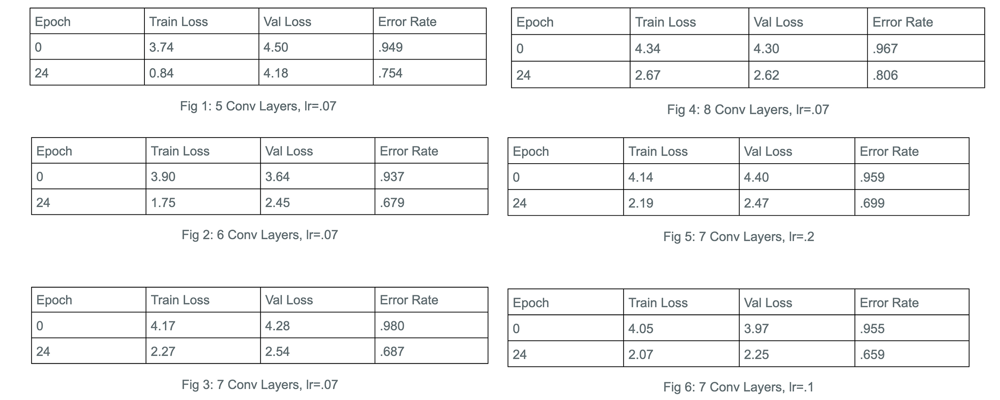
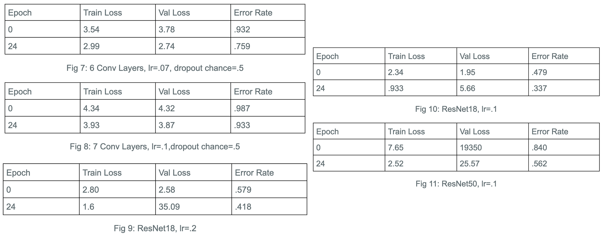

## Neural Unearthing

Group members: Nick Marsano, Daniel Tamkin, Adeline Yu
### Introduction
Geoguessing is a popular web-based game where users are able to guess the location of a randomized Google Street View. The game is challenging, so, as avid Geoguessers ourselves, we thought it would be a worthwhile and fun endeavor to make an application that attempts to guess the locations of a given snapshot.

This image dataset (24 GB) we downloaded focused on scene classification as opposed to geographical location classification. Consequently, we pivoted our project to build a Convolutional Neural Network that could identify scenes rather than geographical locations. The dataset contains 365 categories of various structures, places and locations (amusement park, coffee shop, museum, village etc). Each scene category contains 5,000 training images and 100 validation images. Thus, we decided to build a Convolutional Neural Network that could classify the scene that a given image belongs to. If we build a CNN to classify various scene locations, and we input a random scene, then we expect it to correctly classify that scene. Across all inputs, we expect it to perform >60%. This figure was based on results from the [Geolocation Estimation of Photos using a Hierarchical Model and Scene Classifications](https://openaccess.thecvf.com/content_ECCV_2018/papers/Eric_Muller-Budack_Geolocation_Estimation_of_ECCV_2018_paper.pdf) article that we used to download our dataset, which had similar results on their image geolocation network.

### Methods
The image dataset was found through a research article [Geolocation Estimation of Photos using a Hierarchical Model and Scene Classifications](https://openaccess.thecvf.com/content_ECCV_2018/papers/Eric_Muller-Budack_Geolocation_Estimation_of_ECCV_2018_paper.pdf). We first wanted to scrape Flickr for photos to create our own dataset using [this code](http://graphics.cs.cmu.edu/projects/im2gps/flickr_code.html) but this turned out to be too time intensive and we went with a pre-sorted dataset.

Our intention with this dataset was to create a basic CNN model that could classify an image’s scene. The dataset included 365 different labels for images, which included “watering hole,” “ball pit,” “village,” etc. The dataset was 20 GB, so we used the High Performance Computing server at Pomona to work in. 
We implemented our model using [PyTorch](https://pytorch.org/). 

[The code here](https://github.com/adelineyu/neural-unearthing/blob/a5c5a40783ebbd712be4651441284cce0dd78fc1/cnn.py#L11-L54) is our CNN made from scratch. It is a sequential CNN with 7 linear layers. 

To start, we wanted to work with a smaller batch of images, since our final batch would take well over 2 hours to run the 25 epochs. We ran our model on 7000 training images, which included 100 images from 70 of the 365 classes. 

We at first used an image loader that we had built from scratch ourselves but we ran into a memory issue with the batch sizes. Instead, we used the [ImageDataLoader](https://docs.fast.ai/vision.data.html#ImageDataLoaders) from [FastAI](https://www.fast.ai/) to load in our training images. 

We ran our model with 25 epochs. When we were ready, we ran our final model on 1,825,000 training images and 36,500 validation images, from all 365 scene classifications.

[In these lines](https://github.com/adelineyu/neural-unearthing/blob/a5c5a40783ebbd712be4651441284cce0dd78fc1/cnn.py#L71-L79), we toggled between our model (line 72), ResNet18 (line 75), and ResNet50 (line 78). We also played around with the number of layers in our CNN model, the learning rate, and the inclusion of a dropout layer (which we did not find helpful in our case). 

### Results

In this project we tested two main architectures of neural networks, our own custom CNN as well as two ResNet models, ResNet18 and ResNet50. Our custom CNN was built up through experimentation with the hyperparameters. The main hyperparameters that we tested were the number of convolutional layers and the learning rates. We also tested the inclusion of dropout layers with varying dropout rates. Each of our convolutional layers had a similar setup of a kernel size of 3 with padding and stride of, all followed by Batch Norm, ReLu, and Max Pooling layers. Our Max Pooling layers also had a kernel size and stride of 2, halving the size of our images with each convolutional layer they passed through.

We calculated our own error rates using a Cross Entropy Loss function supplied by fastai and used an Adam optimizer within our learner function. At a consistent learning rate of .07, we tested our network with convolutional layers varying from 5 to 8. With the smaller 5 layer CNN (Fig1) we achieved an error rate of .75.
Continuing to increase the layers, we achieved an error rate of .68 with both our 6 layered network (Fig2) and our 7 layered network (Fig3). This was a nice improvement with a simple change in our network, and while we tried 8 layers as well, we saw a loss in efficiency as we only achieved a .78 error rate (Fig4). We went on to test different learning rates with 7 layers.

First trying a large leap in our learning rate, we tested our network with a learning rate of .2. With this we saw another decline in performance with an error rate of .69 (Fig5).

We went back to a smaller number and noticed that the larger step up didn’t reduce our accuray by too much, we kept our learning rate greater than we originally had it but by a smaller margin than before. Testing at a learning rate of .1 we saw an improvement in our accuracy where our CNN achieved a .65 error rate (Fig6).

At various places in our testing we also wanted to expand out towards other optimization methods so we experimented with dropout layers. We tried dropout layers early on in our testing back at a learning rate of .07, and with 6 convolutional layers, getting an error rate of .75 (Fig7). Seeing this decrease in accuracy didn’t raise our outlook on dropout layers, but we tried again with our 7 layered network when we moved onto a learning rate of .2 and saw an error rate of .93 (Fig8).

When testing these dropout layers, we changed the dropout chance around from lower and higher values, but saw that an average middle value performed best for us.
Having extensively experimented with our own CNN, we wanted to also test out an officially developed and refined neural network in comparison. Opting to work with the ResNet network, we tested both ResNet18 and ResNet50 to get an idea of how the smaller and larger networks would fare once trained on our dataset. To see whether or not it was just our own CNN suffering from the larger learning rate, we tested ResNet18 on both a learning rate of .2 and .1. Our results continued to have the same theme however and with a learning rate of .2 the ResNet model achieved an error rate of .41 (Fig9), while the learning rate of .1 offered an error rate of .33 (Fig10).

Seeing that again, the learning rate of .1 was performing best, we went ahead with using ResNet50 on our data set and achieved an error rate of .56 (Fig11), a worse performance over it’s smaller variant.

Unsurprisingly, the official ResNet18 model exceeded our own custom CNN by miles. However, even our best model (Fig6) of 7 convolutional layers and a learning rate of .1, beat random guessing by having 34% accuracy compared to a chance of 1 in 750 (.13% accuracy).

While our accuracy and model may not be anything to write home about, the processes we went through, from creating our own data loader that was later replaced with a FastAI version in order to implement batches seamlessly, to creating our own layers, calculating input sizes, and seeing what seemed to work best, were great experiences both for learning purposes and comfort purposes when it came to hands on work with neural networks. It was also an interesting journey in that we were confronted multiple times by the challenge of our project. Initially setting out to classify geographical locations, we ended up classifying scenes instead. That transition was the culmination of reading previous studies and works about neural networks, data sets, and the geographical classification problem. Realizing that the original problem was perhaps too much to handle for first-timers, we found ourselves being guided by our study and by the availability of data to our current results.

### Literature Review

There is a collection of pre-existing studies that we took inspiration from, ranging from scene classification to location classification based on an input of an image snapshot.

In the [IM2GPS article](http://graphics.cs.cmu.edu/projects/im2gps/im2gps.pdf), researchers performed a similar project. They set out with the goal to estimate geolocation from a single image via training a neural network on 6 million images scraped from Flickr and labeled with geotags. Using a nearest neighbor algorithm to compare individual photos with each of their 6 million images, comparing features such as line features, tiny images, color histograms built from the images, and more, they displayed the geographic location of a photo as a probability distribution over the Earth’s surface.

Researchers who published the [DeepGeo article](https://arxiv.org/abs/1810.03077) share a similar intent as us with creating a model that could do well at playing the game GeoGuessr. They ended up making a model that was 20 times better than chance at predicting random locations in the US. This model could beat humans in 4 out of 5 rounds of the game. They created the 50states10K dataset which is a set of 125000 samples, 10000 unique images of each of the 50 states gathered from Google Street View. This is a dataset we are interested in looking at for our project.

This [PlaNet article](https://arxiv.org/abs/1602.05314) approaches the issue of photo geolocation through image classification. They subdivided the earth into thousands of multi-scale geoegraphic cells and trained a neural network using millions of geotagged images. Rather than using landmarks or approximate matching, their models integrate multiple visual cues to guess the image location. Their’s exceeded all others and even attained superhuman levels of accuracy in some cases.

This [article](https://phys.org/news/2008-06-geographic-photos.html) describes the IM2GPS algorithm designed by Carnegie Mellon University. The algorithm doesn’t attempt to identify distinguishing features within the photo but rather “analyzes the composition of the photo, notes how textures and colors are distributed and records the number and orientation of lines in the photo.” and then searching Flickr for similar photos. Instead of asking the computer to analyze a photo, the computer just needs to find photos that look like a given photo.

### Ethics
We did not see any large ethical implications of our project. Perhaps an application of this project could lead to misclassifications of certain locations but we see those implications to be currently trivial. 

Instead we chose to look at a research project that used image classification in a problematic way: to determine criminality. The paper is titled [Automated Inference on Criminality Using Face Images](https://arxiv.org/pdf/1611.04135v1.pdf)

Some researchers from Shanghai Jiao Tong University collected ID photos of Chinese males and tested various classification techniques to see how effective these techniques were in recognizing whether the photo was of a criminal or not. They boast that their CNN achieved 89.51% accuracy. They also claim they used other classification techniques to find distinguishing features of “what makes a criminal a criminal.”

Their paper unconvingily portrays their intent as innocent, however, social perception based on physical appearance is, at the root, a highly problematic behavior. The program they want to build predicts someone’s membership to a group based on physical appearances. This is simply just reinforcing pre-existing biases. 

As a byproduct, the paper raises an important concern of what we should be using CNNs for. Are we reinforcing biases and discriminating against certain groups with our programs? In what ways are we unknowingly harming society in general? 

### Reflection
From this project, we have gained a deeper understanding of the implementation of neural networks and the importance of a good dataset. Initially, we tried to scrape Flickr to build our own dataset of locations, but ultimately we were unable to execute the code. Therefore, we downloaded a dataset that was already created. We also implemented our own CNN. Through this process, we learned the importance of correctly setting up each layer and matching the dimensions of each output to the input of the next layer. When testing our layers, we learned the importance of different types of layers and the effects they have on the accuracy of an image classifier.

However, no matter how many modifications we did to our layers, we were never able achieve more than 35% accuracy. Even networks like Resnet18 or Resnet50 were unable to get more than 70% accuracy on our dataset. These results prompted us to look more closely at some of the images in our dataset. We noticed that some of these images were far from perfect - blurry, colorless or even unclear. Some of these images would have even been difficult for a human to classify. We experienced firsthand what a bad dataset can do to good classifiers, which is producing poor results. Next time, we would like to do this again but with a better dataset of more modern images. Possibly getting the Flickr code scraper to work, so that we have more scenes and higher quality pictures to work with.

To continue this work, we would like to take the next step of location classification. We have built a neural network that is able to classify 365 different scenes. However, we would like to build a neural network that can guess the location of any input image. We would build a new network that would subdivide the earth into different ‘location nodes’ and try to classify images as belonging to a certain location, and the final result would integrate the results from our scene classification network to achieve more accurate results. The biggest challenge of this technique would be how to integrate both, since one location node might contain hundreds of possible scenes within it. Researchers have had success with subdividing the earth into various nodes [PlaNet article](https://arxiv.org/abs/1602.05314), so the biggest challenge of this technique would be integrating the scene results from our network, since one location node might contain hundreds of different scenes within it. A possible way to do this would be to use the scene results as a way to eliminate location nodes that do not contain certain scenes within them.

